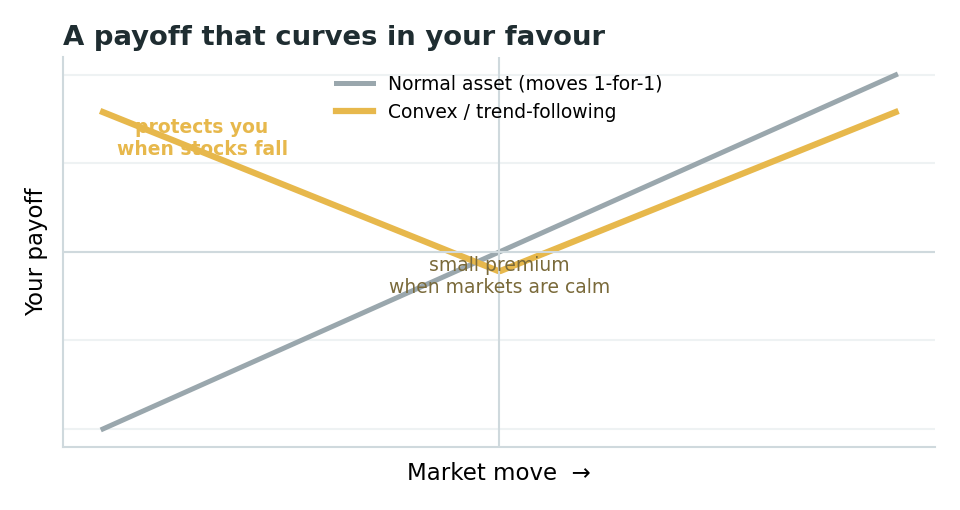
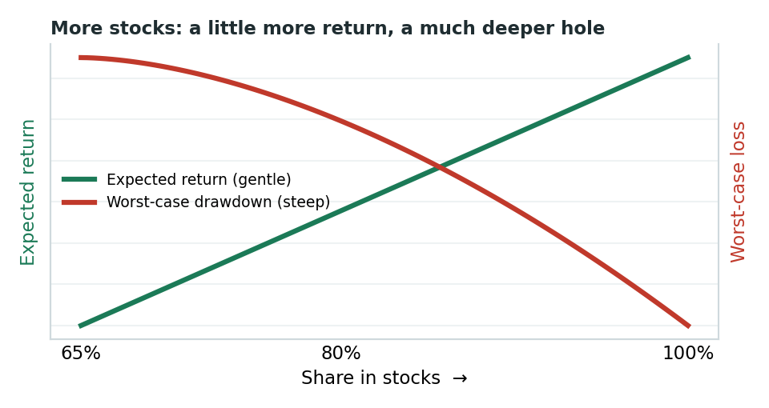
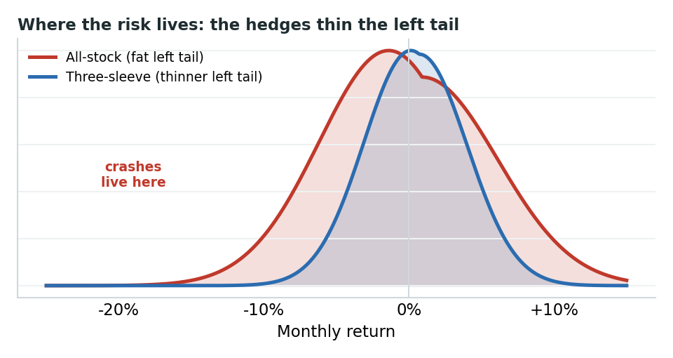
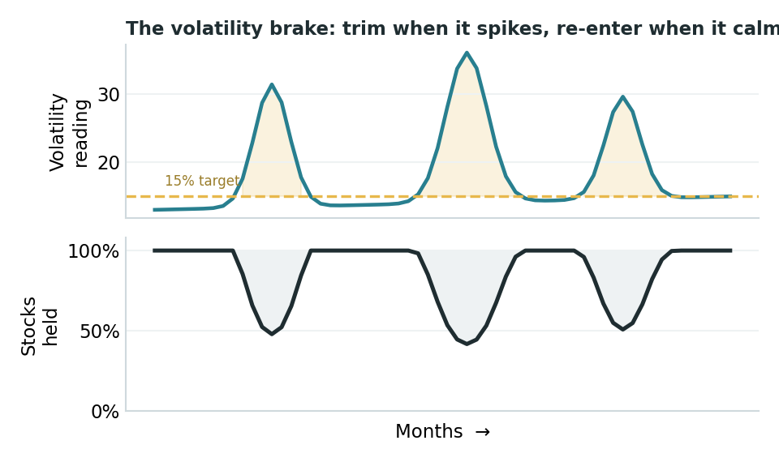

# Risk-Adjusted Compounding with the Convex Core Portfolio

*A plain-English guide for do-it-yourself ETF and mutual-fund investors - how Growth, Duration, and Convexity work together to compound wealth while reducing deep drawdown risk.*

**DNSR Investments - DIY Edition**  
**Not investment advice**

This is the everyday-investor version of a longer research note. No math is required to use it. The whole strategy rests on one simple idea, three jobs, and a handful of funds.

Convex Core is a simplified, practical synthesis of several of the most durable ideas in risk-adjusted compounding: geometric-growth logic, broad diversification, risk budgeting, trend-following crisis alpha, and optional volatility management.

---

## The one idea: don't dig deep holes

Most investing advice chases higher returns. This portfolio is built around a quieter truth: **avoiding big losses matters more than catching big gains**, because losses are asymmetric. Lose 50% and you do not need +50% to get back - you need +100%. The deeper the hole, the more punishing the climb out.

### Long-run growth, in one line

**g ≈ μ − ½σ²**

In plain English:

**Growth of investment assets ≈ average return − a volatility/drawdown penalty**

Your long-term growth (**g**) is roughly your average return (**μ**) minus a penalty for bumpiness (**σ²**). The bumpiness is subtracted - so smoothing the ride, especially cutting the deep drops, can raise your real compounded growth even if it slightly lowers your average return. Giving up a sliver of upside to avoid the holes is not timidity. It is math.

### Portfolio allocation, in one line

**Wgrowth + Wconvex + Wduration = 1**

Where:

- **Wgrowth** = weight in Growth
- **Wconvex** = weight in Convexity
- **Wduration** = weight in Duration

Intuition: Growth mainly lifts returns; Duration and Convexity aim to smooth the ride. That matters because the growth equation subtracts a penalty for volatility and deep drawdowns.

That is why the portfolio is not designed to maximize stock exposure by itself. The three-sleeve model is what you get when you stop maximizing return alone and instead maximize compounded growth: enough **Growth** to drive **μ**, plus **Duration** and **Convexity** to reduce the **σ²** penalty across different crash regimes.

---

## Three jobs, three sleeves

Instead of guessing what will go up, the portfolio assigns three jobs and fills each with the right kind of fund - one engine and two different kinds of insurance.

**Growth** - Plain stock ownership - the long-run source of returns. The biggest slice.

**Duration** - High-quality bonds, especially Treasuries. In a recession/deflation panic - 2008, 2020 - money often floods into Treasuries and they can rise while stocks fall.

**Convexity** - Trend-following managed futures. In 2022, inflation knocked down stocks and bonds together; this sleeve was one of the few things that went up. It is the insurance that can pay off when bonds do not.

**Why you need both insurances:** no single hedge covers every crash. Bonds can help in a deflation panic but fail in an inflation shock; trend-following can help in an inflation or persistent-trend shock but can lag a sudden one-day crash.

---

## What "convexity" actually means

Convexity is just a payoff that curves in your favor. As the market moves more, a convex holding's gains grow faster and its losses shrink - the payoff line bends upward instead of running straight. The opposite, concavity, bends against you: small steady gains, then a blow-up in a crisis. A convex position likes big moves in either direction; in the trade it is called being "long volatility."

A normal asset moves one-for-one with the market. A convex holding bends upward at both ends - it may make money in big sustained moves either way and give a little back when markets are calm.

Read the convex curve this way: when stocks fall hard, it can rise - that is the part that protects you. When markets are quiet, it may lose a little - that small, steady cost is the insurance premium you pay for the protection. This is the shape you want bolted onto a stock portfolio, because the protection is designed to show up when your stocks are getting hurt.



*Illustrative: a payoff that curves in your favour.*

---

## What are "managed futures" and "trend-following"?

**Managed futures** are funds that buy and sell futures contracts - standardized agreements to buy or sell stocks, bonds, currencies, or commodities at a set future price. The key feature: they can go both long, betting a price rises, and short, betting a price falls. That ability to profit from falling markets is what lets them help in a crash.

**Trend-following** is the most common managed-futures strategy, and a purely rules-based one: buy what has been going up, short what has been going down, and ride the move until it reverses. No forecasting, no opinions - it simply reacts to price.

### How that produces convexity

Put those two together and the convex smile falls out naturally:

- **In a sustained crash**, prices trend down. The fund can flip short and earn more the further markets fall - so the payoff bends up on the left, the crash side.
- **In a sustained boom**, it can be long and ride the move up - so it gains on the right too.
- **In choppy, directionless markets**, trends keep starting and reversing, and the fund can get whipsawed into small losses - the dip in the smile, or the insurance premium.

Researchers Fung and Hsieh showed that this payoff statistically resembles owning a straddle - holding both a put and a call, which profits whenever the price moves a lot in either direction. That is the textbook definition of a convex, long-volatility position. Trend-following can provide that shape without directly buying options.

---

## An example portfolio you could actually build

Illustrative weights of **65% Growth / 15% Convexity / 20% Duration** - the research model's split. Funds are examples, not recommendations; swap equivalents freely, such as SPY for VOO.

| Sleeve | What it does | Example funds | Weight |
|---|---|---:|---:|
| **Growth** | US large-cap core | VOO or SPY | 38% |
|  | International stocks | VXUS | 15% |
|  | US small-cap value tilt | AVUV | 12% |
| **Growth subtotal** |  |  | **65%** |
| **Convexity** | Managed-futures ETF replication | DBMF | 8% |
|  | Trend-following mutual fund | AQMNX / AQMIX | 7% |
| **Convexity subtotal** |  |  | **15%** |
| **Duration** | Treasuries, tax-free accounts | IEF / VGIT / TLT / GOVT | 20% |
|  | Or, in a taxable account, municipal bonds | VTEB / MUB | (20%) |
| **Duration subtotal** |  |  | **20%** |

### Why two funds in the Convexity sleeve?

DBMF and the AQR Managed Futures fund do the same job differently, so holding both can be sensible diversification, not redundancy.

- **DBMF** is an ETF that replicates the average big managed-futures fund - lower-cost, easy to buy anywhere, and, as an ETF, relatively tax-friendly.
- **AQR Managed Futures** is a hands-on trend-following mutual fund with a long record and a slightly negative tie to stocks. It trades a lot, so it is pricier and tax-inefficient - which is why it belongs in a retirement account.

---

## "What if I just hold more stocks?"

A fair question. Stocks have the highest long-run return, so why not push the equity slice from 65% up toward 95% or 100%? You can - but be clear about the trade you are making. More stocks buys you a little extra expected return and a lot more downside.

As the stock share climbs from 65% toward 100%, expected return rises gently while the worst-case drawdown deepens sharply. The lines cross - you are paying a steep risk price for a small return gain.



*Illustrative: more stocks — a little more return, a much deeper hole.*

Three things happen as you crank equity toward 1.0:

1. **Average return rises - modestly.** Going from 65% to 100% stocks may lift expected return by roughly a point or so a year. Real, but small.
2. **The holes get much deeper.** A balanced version might lose much less in a bad crash; an all-stock version lost about 50% in 2008. Remember the one idea - recovering from -50% takes +100%. That asymmetry quietly eats the extra return.
3. **You delete the insurance.** At 95-100% stocks there is almost no Duration and no Convexity left. The portfolio that handled 2022 better becomes the portfolio that got hit by it. You have removed the very thing the design exists for.

You can see the cost in the shape of returns. An all-stock portfolio has a fatter, longer left tail - the rare, deep losses. The three-sleeve mix pulls that tail in.



*Illustrative: the hedges thin the crash-side (left) tail.*

Each curve shows how often different monthly returns happen. The tails are the rare extremes at the edges. The left tail - crashes - is what does lasting damage; the hedges are designed to make the Convex Core portfolio's left tail thinner and shorter than the all-stock one.

So "more stocks" is not wrong - it is a choice to accept deeper holes for a bit more upside. If your horizon is very long, you never withdraw in a downturn, and you can truly ignore a 50% drop, a higher equity weight may suit you. If you would panic-sell at the bottom, or you will be drawing income, the deep left tail is exactly the risk the 65/15/20 mix is built to tame.

---

## How it behaves in different crashes

| Type of crash | Recent example | What falls | What protects you |
|---|---|---|---|
| Recession / deflation panic | 2008, 2020 | Stocks | **Duration** - Treasuries rally |
| Inflation / rate shock | 2022 | Stocks and bonds | **Convexity** - trend profits |
| Normal bull market | Most years | - | **Growth** does the work; insurance costs a little |

---

## Where to hold what - the tax-smart setup

If you have both a taxable brokerage account and an IRA/Roth, treat them as one portfolio: tax-friendly things go in taxable; tax-heavy things go in the IRA.

| Account | Put here | Why |
|---|---|---|
| **Taxable brokerage** | VOO/SPY, VXUS, AVUV, DBMF, VTEB/MUB | Stocks are taxed gently because of low turnover and qualified dividends. DBMF's ETF wrapper is relatively tax-friendly. For bonds, municipal bonds such as VTEB/MUB pay federally tax-free interest - they replace Treasuries here to reduce tax on bond income. |
| **IRA / Roth** | AQMNX/AQMIX, IEF/VGIT/TLT | The AQR fund trades constantly and Treasury interest is taxed as ordinary income - both would be taxed heavily in a brokerage account. Inside an IRA, that turnover and income cost you nothing currently. |

**Honest trade-off:** municipal bonds are an imperfect swap for Treasuries. They give tax-free income but do not jump as hard in a true flight-to-safety panic. If deflation-crash protection is the priority, real Treasuries in the IRA are the stronger hedge; munis are the tax-friendly compromise for the taxable side.

---

## Measuring volatility - and using it to lower your risk

Here is a simple, repeatable tool that is designed to improve your risk-adjusted returns: more return per unit of stomach-churn. The idea is that you cannot predict returns reliably, but volatility is more persistent - wild days cluster together. So when the market gets wild, briefly hold fewer stocks; when it calms down, go back to full.

### Step 1 - Measure volatility, about 10 minutes a month

1. Pull the daily closing prices of your main stock fund, such as VOO, for the last 21 trading days - roughly one month. Any free site or spreadsheet can do this.
2. Turn them into daily percentage changes: today divided by yesterday, minus 1.
3. Take the standard deviation of those daily changes. In a spreadsheet: `=STDEV()`.
4. Annualize it: multiply by 16, more precisely √252 ≈ 15.9. That number is your annualized volatility - your "weather reading."

**Worked example:**

```text
daily standard deviation = 1.9% / day
annualized volatility    = 1.9% x 16 ≈ 30% / year
```

That is high. Calm markets often sit near 12-15%.

### Step 2 - Use it: the "volatility brake"

Pick a target volatility - 15% is a reasonable everyday number. Then set how much of your stock sleeve to actually hold:

**stocks to hold = min(100%, target ÷ your reading)**

Examples:

```text
reading 15% -> 15 ÷ 15 = 100%   hold it all - never use leverage
reading 30% -> 15 ÷ 30 = 50%    hold half; park the rest in a money-market / T-bill fund
reading 45% -> 15 ÷ 45 ≈ 33%    hold a third
```

When the storm passes and your reading falls back to 15%, you step back to 100%. That is the whole rule.



*Illustrative: measure volatility, trim when it spikes, re-enter as it calms.*

### Why it helps

The worst market days bunch together, so trimming during high-volatility stretches can sidestep a chunk of the deepest drops - which, back to the one idea, is where compounding is won or lost. Historically, rules like this have often raised return-per-unit-of-risk for stocks.

**Keep it honest and simple:** check monthly, not daily, so you do not over-trade. It is not magic - sometimes it trims right before a sharp V-shaped rebound and you miss some upside. Run it inside an IRA where the trimming creates no tax bill. And if this feels like too much, skip it - the three-sleeve structure already does most of the work.

---

## The simple rules for running it

1. **Pick your weights**, for example 65 / 15 / 20, and buy the funds.
2. **Leave it alone.** No predicting, no tinkering.
3. **Rebalance once or twice a year** back to target - or steer new contributions into whatever sleeve has lagged. In a crash, that means trimming the hedge that paid off and buying stocks while they are cheap.
4. **Optional:** run the volatility brake on your stock sleeve. Powerful, but skippable.

---

## Honest caveats - read before you buy

**Trend-following is insurance, and insurance has a cost.** In calm, choppy markets, DBMF and the AQR fund may lose money for long, boring stretches. That is the premium - do not sell it just because it lagged in a bull market.

**Managed futures cost more than index ETFs**, and the AQR fund is tax-inefficient - hence the IRA placement.

**You will trail a roaring bull market.** By design, about 35% of this portfolio is not in stocks. The payoff comes in the bad years.

**The charts here are illustrative**, drawn to teach the ideas - not backtested results, and not a promise. Markets can behave in new ways.

---

## Important disclosure

DNSR Investments, LLC. For education only - not investment, tax, or legal advice, and not a recommendation to buy or sell any security. Fund names and tickers are illustrative examples of each sleeve's role, not endorsements; expenses, structures, and tax treatment vary and change over time. Municipal-bond interest may be subject to state tax and the AMT depending on your situation. All charts are illustrative, not backtests. Confirm specifics with the fund prospectus and a qualified financial advisor and CPA before investing. The portfolio logic is fully deterministic - no AI participates in the allocation decisions.
